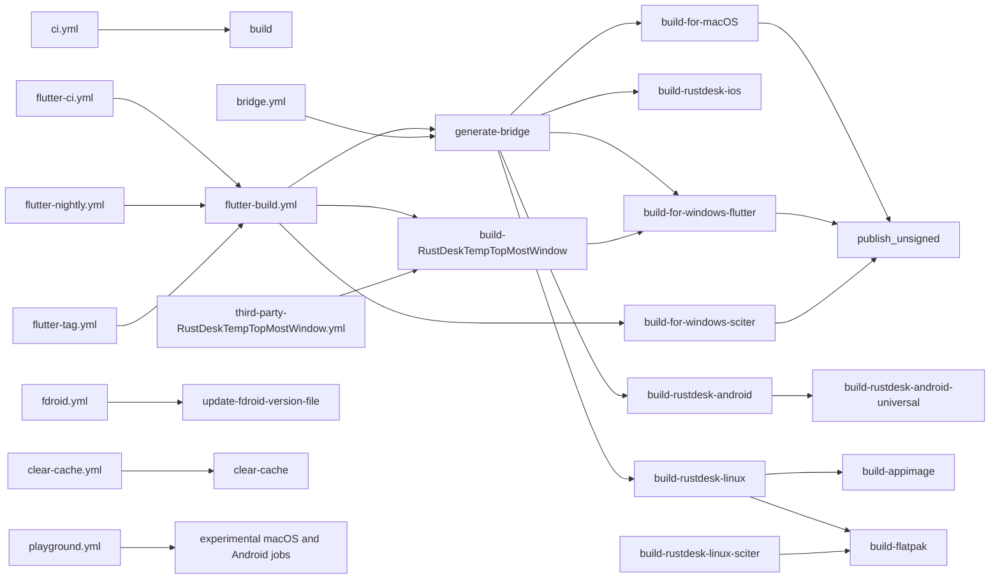

# GitHub Actions Workflows

This document summarizes the GitHub Actions workflows currently defined in this repository under `.github/workflows/`.

It covers:

- the general ideas behind GitHub Actions
- a brief on `act`
- the workflow and job structure found in this repository
- a high-level dependency diagram for the main build pipeline

## General GitHub Actions ideas

GitHub Actions is GitHub's CI/CD system. The main concepts are:

- Workflow: a YAML file in `.github/workflows/` that defines automation.
- Event trigger: what starts the workflow, such as `push`, `pull_request`, `workflow_dispatch`, `schedule`, or `push.tags`.
- Job: a unit of work inside a workflow. Jobs run on runners such as Ubuntu, Windows, or macOS.
- Step: an individual command or action inside a job.
- Action: a reusable step, usually referenced with `uses: owner/repo@version`.
- Runner: the machine that executes a job, for example `ubuntu-24.04` or `windows-2022`.
- Matrix: a way to run the same job across multiple targets, architectures, or OSes.
- Artifact: files uploaded by one job and optionally downloaded by another job.
- `needs`: a dependency edge between jobs.
- Reusable workflow: a workflow triggered with `workflow_call` and invoked by another workflow using `uses: ./.github/workflows/file.yml`.
- Secrets: encrypted values injected at runtime for signing, publishing, or authenticated access.

In this repository, reusable workflows and artifacts are central. The main build workflow delegates helper tasks into smaller reusable workflows, then uses uploaded artifacts to connect later packaging and release jobs.

## Brief on `act`

`act` is a local runner for GitHub Actions workflows. It lets you execute many GitHub workflows locally using Docker instead of pushing commits to GitHub.

What `act` is good for:

- validating workflow syntax and basic job logic
- testing shell steps and local script behavior
- iterating on Linux-based workflows faster than pushing to GitHub
- running a single job or workflow in isolation

What `act` is not a perfect match for:

- macOS and Windows hosted runner behavior
- GitHub-hosted cache, release publishing, and signing integrations
- workflows that rely on GitHub secrets, external services, or hosted toolcache layout
- some marketplace actions that assume the real GitHub Actions environment

For this repository in particular, `act` is most useful for:

- the simpler Linux-oriented workflows such as `ci.yml`
- dry-running pieces of `flutter-build.yml` that do not depend on hosted Windows/macOS runners
- basic troubleshooting of triggers, `needs`, shell logic, and artifact flow

It is much less reliable for:

- Windows packaging
- macOS notarization or codesigning
- Android signing
- release publishing
- scheduled and tag-release behavior that depends on GitHub state

Typical `act` examples:

```bash
act workflow_dispatch -W .github/workflows/ci.yml
act pull_request -W .github/workflows/ci.yml
act -j build -W .github/workflows/ci.yml
act workflow_dispatch -W .github/workflows/flutter-ci.yml
```

Artifact note for this repository:

- several jobs hand files to later jobs with `actions/upload-artifact` and `actions/download-artifact`
- when running those workflows with `act`, enable the local artifact service or uploads will fail with `Unable to get ACTIONS_RUNTIME_TOKEN env variable`
- known `act` problems and their command-line fixes are collected in `flutter/doc/act-known-issues.md`
- the same note also includes the local `aarch64` / `arm64-v8a` build command
- minimal example for the universal Android job:

```bash
act -W .github/workflows/flutter-build.yml -j build-rustdesk-android-universal --artifact-server-path ./.act-artifacts -P ubuntu-24.04=ghcr.io/catthehacker/ubuntu:act-24.04 -s GITHUB_TOKEN=YOUR_TOKEN
```

- `build-rustdesk-android-universal` depends on earlier jobs that upload `bridge-artifact` and ABI-specific Android `.so` files, so local artifact support is required for that job graph
- in this workspace, `.github/workflows/flutter-build.yml` currently has only the `aarch64-linux-android` Android matrix entry enabled, so use `build-rustdesk-android` for the local `arm64-v8a` path unless you re-enable the other Android targets
- if `act` says `Skipping unsupported platform`, add a platform mapping for `ubuntu-24.04`; if the smaller image is not sufficient, try `ghcr.io/catthehacker/ubuntu:full-24.04`
- `flutter-ci.yml` passes `upload-artifact: false`, so it is not the right entry point if you want to run the universal APK job locally

If secrets are required, pass them with `-s KEY=value` or a secrets file. For large workflows in this repo, expect to need Docker images with enough disk and memory, especially for Rust, Flutter, Android, and packaging steps.

## Workflow inventory in this repository

### `ci.yml`

Path: `.github/workflows/ci.yml`

Purpose:

- legacy Rust CI for native build verification

Triggers:

- `workflow_dispatch`
- `pull_request`
- `push` to `master`

Jobs:

- `build`
  - builds the Rust project for `x86_64-unknown-linux-gnu`
  - installs Linux system dependencies
  - installs vcpkg dependencies
  - installs Rust
  - runs `cargo build --locked --target=...`

Notes:

- several older jobs are present but commented out
- this is much narrower than the Flutter build pipeline

### `flutter-ci.yml`

Path: `.github/workflows/flutter-ci.yml`

Purpose:

- main CI entrypoint for the cross-platform Flutter-based product

Triggers:

- `workflow_dispatch`
- `pull_request`
- `push` to `master`

Jobs:

- `run-ci`
  - calls the reusable workflow `flutter-build.yml`
  - passes `upload-artifact: false`

Notes:

- this is effectively the non-release CI path
- it reuses the main build graph but avoids release publication

### `flutter-nightly.yml`

Path: `.github/workflows/flutter-nightly.yml`

Purpose:

- nightly release-oriented build

Triggers:

- nightly `schedule`
- `workflow_dispatch`

Jobs:

- `run-flutter-nightly-build`
  - calls `flutter-build.yml`
  - sets `upload-artifact: true`
  - sets `upload-tag: nightly`

### `flutter-tag.yml`

Path: `.github/workflows/flutter-tag.yml`

Purpose:

- release build for version tags

Triggers:

- `workflow_dispatch`
- `push` on semver-like tags

Jobs:

- `run-flutter-tag-build`
  - calls `flutter-build.yml`
  - sets `upload-artifact: true`
  - sets `upload-tag` to the pushed tag name

### `flutter-build.yml`

Path: `.github/workflows/flutter-build.yml`

Purpose:

- main reusable cross-platform build and packaging workflow

Trigger:

- `workflow_call`

Inputs:

- `upload-artifact`
- `upload-tag`

Main jobs:

- `generate-bridge`
  - calls `bridge.yml`
  - generates Flutter-Rust bridge files used by downstream jobs

- `build-RustDeskTempTopMostWindow`
  - calls `third-party-RustDeskTempTopMostWindow.yml`
  - builds an external Windows DLL dependency

- `build-for-windows-flutter`
  - depends on bridge generation and the external DLL build
  - builds the Windows Flutter app
  - restores helper artifacts
  - downloads additional drivers/components
  - optionally signs binaries
  - creates portable `.exe` and `.msi`
  - publishes release assets when uploads are enabled

- `build-for-windows-sciter`
  - builds the fallback 32-bit Windows Sciter version
  - creates a portable executable
  - optionally signs and publishes it

- `build-rustdesk-ios`
  - builds the Rust static library for iOS
  - builds the iOS Flutter app path
  - mostly build-focused; publish steps are currently commented out

- `build-for-macOS`
  - builds macOS Flutter packages for Intel and Apple Silicon
  - creates unsigned DMGs
  - optionally codesigns and notarizes them
  - publishes DMGs

- `publish_unsigned`
  - depends on macOS and Windows build jobs
  - aggregates unsigned Windows and macOS artifacts
  - publishes them as a single tarball

- `build-rustdesk-android`
  - matrix build for Android ABIs
  - builds Rust shared libraries
  - copies them into the Flutter Android project
  - builds per-ABI APKs
  - optionally signs and publishes them

- `build-rustdesk-android-universal`
  - depends on `build-rustdesk-android`
  - downloads ABI-specific Rust libraries
  - builds a universal APK
  - optionally signs and publishes it

- `build-rustdesk-linux`
  - matrix build for Linux `x86_64` and `aarch64`
  - builds the Flutter Linux app
  - packages Debian and RPM outputs
  - also builds Arch packages for `x86_64`

- `build-rustdesk-linux-sciter`
  - matrix build for Linux Sciter variants
  - currently targets `x86_64` and `armv7`
  - packages Debian outputs

- `build-appimage`
  - depends on `build-rustdesk-linux`
  - repackages Linux `.deb` artifacts into AppImages

- `build-flatpak`
  - depends on `build-rustdesk-linux` and `build-rustdesk-linux-sciter`
  - repackages Linux `.deb` outputs into Flatpaks

- `build-rustdesk-web`
  - currently disabled with `if: False`
  - contains a draft web build path

### `bridge.yml`

Path: `.github/workflows/bridge.yml`

Purpose:

- reusable helper workflow that generates Flutter-Rust bridge outputs

Trigger:

- `workflow_call`

Jobs:

- `generate_bridge`
  - checks out the repo
  - installs Rust, Flutter, and bridge codegen dependencies
  - runs `flutter_rust_bridge_codegen`
  - uploads generated Rust, Dart, and header files as `bridge-artifact`

### `third-party-RustDeskTempTopMostWindow.yml`

Path: `.github/workflows/third-party-RustDeskTempTopMostWindow.yml`

Purpose:

- reusable helper workflow for a Windows DLL dependency

Trigger:

- `workflow_call`

Jobs:

- `build-RustDeskTempTopMostWindow`
  - clones the external `RustDeskTempTopMostWindow` repository
  - checks out a pinned commit
  - builds `WindowInjection.dll`
  - uploads the DLL as an artifact

### `fdroid.yml`

Path: `.github/workflows/fdroid.yml`

Purpose:

- publishes a small version metadata file for F-Droid automation

Triggers:

- `workflow_dispatch`
- `push` on semver-like tags

Jobs:

- `update-fdroid-version-file`
  - computes `versionName`
  - computes F-Droid style `versionCode`
  - publishes `rustdesk-version.txt` to the `fdroid-version` release tag

### `clear-cache.yml`

Path: `.github/workflows/clear-cache.yml`

Purpose:

- maintenance workflow to purge GitHub Actions caches

Trigger:

- `workflow_dispatch`

Jobs:

- `clear-cache`
  - lists current caches using the GitHub API
  - deletes them
  - runs an extra purge action as a second pass

### `playground.yml`

Path: `.github/workflows/playground.yml`

Purpose:

- manual experimental workflow for trying older refs and toolchain combinations

Trigger:

- `workflow_dispatch`

Jobs:

- `build-for-macOS`
  - builds several historical macOS matrix combinations

- `build-rustdesk-android`
  - experimental Android build path

Notes:

- this does not appear to be the main production CI path
- it is useful as a scratchpad for build experiments

## High-level diagram



## Practical reading guide

If you are trying to understand the repo quickly, read the workflows in this order:

1. `flutter-ci.yml`
2. `flutter-build.yml`
3. `bridge.yml`
4. `third-party-RustDeskTempTopMostWindow.yml`
5. `ci.yml`
6. `fdroid.yml`
7. `clear-cache.yml`
8. `playground.yml`

That order follows the normal CI path first, then the helper workflows, then the side workflows.

## Practical takeaways for this repository

- The main CI design here is centered on one reusable workflow: `flutter-build.yml`.
- `flutter-ci.yml`, `flutter-nightly.yml`, and `flutter-tag.yml` are mostly wrappers that choose when and how to invoke that reusable workflow.
- Bridge code generation is a first-class dependency and is shared through uploaded artifacts.
- Artifact flow is important: several later jobs depend on outputs from earlier platform jobs instead of rebuilding everything from scratch.
- Linux packaging fans out after the main Linux builds into AppImage and Flatpak packaging.
- Some workflows are clearly operational or support workflows rather than product-build workflows, such as cache clearing and F-Droid metadata publication.
- `playground.yml` is best treated as experimental unless intentionally revived.
